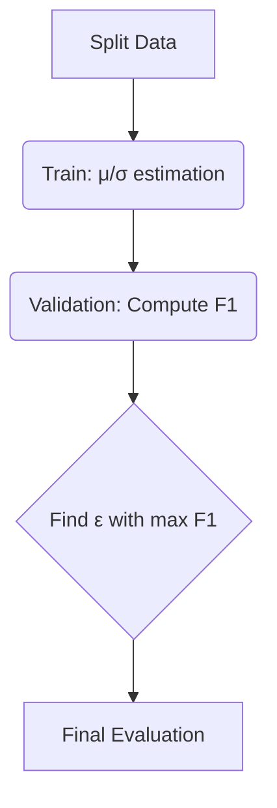
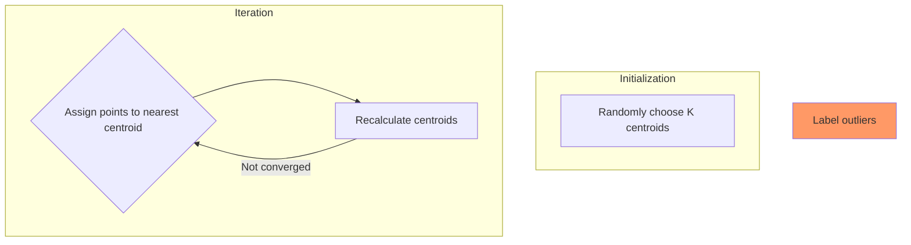

# Anomaly Detection & Clustering Guide


*Figure 1: Integrated workflow for anomaly detection and clustering*

---

## 1. Gaussian-Based Anomaly Detection

### 1.1 Core Steps
#### Step 1: Gaussian Parameter Estimation
Estimate mean (μ) and variance (σ²) for each feature using training data:


```python
def estimate_gaussian(X):
   mu = np.mean(X,axis=0)
   var = np.var(X,axis=0)
   return mu,var
```

- **Univariate Gaussian**: Compute per-feature parameters
- **Multivariate Gaussian**: Calculate covariance matrix Σ for correlated features

#### Step 2: Probability Density Calculation
Compute likelihood for new samples using Gaussian:

```python
p = np.prod((1 / (np.sqrt(2*np.pi)*sigma)*np.exp(-(X - mu)**2 / (2*sigma)), axis=1)
```


#### Step 3: Cross-Validation for Threshold (ε)




*Figure 2: Threshold selection workflow*

**F1 Optimization Logic**:

```python

def select_threshold(yval, pval):

   best_epsilon = best_f1 = 0

   for epsilon in np.linspace(pval.min(), pval.max(), 1000):

      predictions = (pval < epsilon)

      tp = np.sum((predictions == 1) & (yval == 1))

      fp = np.sum((predictions == 1) & (yval == 0))

      fn = np.sum((predictions == 0) & (yval == 1))

      precision = tp/(tp+fp) if (tp+fp) else 0

      recall = tp/(tp+fn) if (tp+fn) else 0

      f1 = 2precisionrecall/(precision+recall) if (precision+recall) else 0

      if f1 > best_f1:

         best_f1, best_epsilon = f1, epsilon

    return best_epsilon, best_f1
```


---

## 2. K-means Clustering

### 2.1 Algorithm Implementation





*Figure 3: K-means workflow with outlier detection[6,7](@ref)*

**Key Steps**:
1. **Elbow Method for K Selection**  
   Plot WCSS (Within-Cluster Sum of Squares) to find optimal K[7](@ref)
2. **Distance Metric**  
   Use Euclidean distance: `distance = ||x - μ||²`
3. **Outlier Identification**  
   Flag points >nσ from nearest centroid as anomalies[6](@ref)

### 2.2 Evaluation Metrics
| Metric          | Formula                      | Purpose                     |
|-----------------|------------------------------|-----------------------------|
| Silhouette Score| `(b-a)/max(a,b)`             | Cluster separation quality  |
| Davies-Bouldin  | `(σi + σj)/distance(ci,cj)`  | Inter/intra-cluster balance |

---

## 3. Applications

### 3.1 Anomaly Detection
- **Industrial QA**: Detect defective products using sensor data
- **Cybersecurity**: Identify network intrusion patterns
- **Healthcare**: Flag abnormal ECG readings

### 3.2 Clustering Use Cases
- **Customer Segmentation**: Group users by purchase behavior
- **Image Compression**: Reduce color space via centroid colors
- **Document Clustering**: Organize news articles by topics

---

## 4. Code Implementation

### 4.1 Gaussian Anomaly Detection


```python

#Full pipeline

mu_train, sigma_train = estimate_gaussian(X_train)

p_val = multivariate_gaussian(X_val, mu_train, sigma_train)

epsilon, _ = select_threshold(y_val, p_val)

anomalies = X_test[multivariate_gaussian(X_test, mu_train, sigma_train) < epsilon]
```


### 4.2 K-means with Scikit-learn

```python

from sklearn.cluster import KMeans

model = KMeans(n_clusters=3).fit(X)

outliers = X[np.linalg.norm(X - model.cluster_centers_, axis=1) > 3*X.std()]
```
